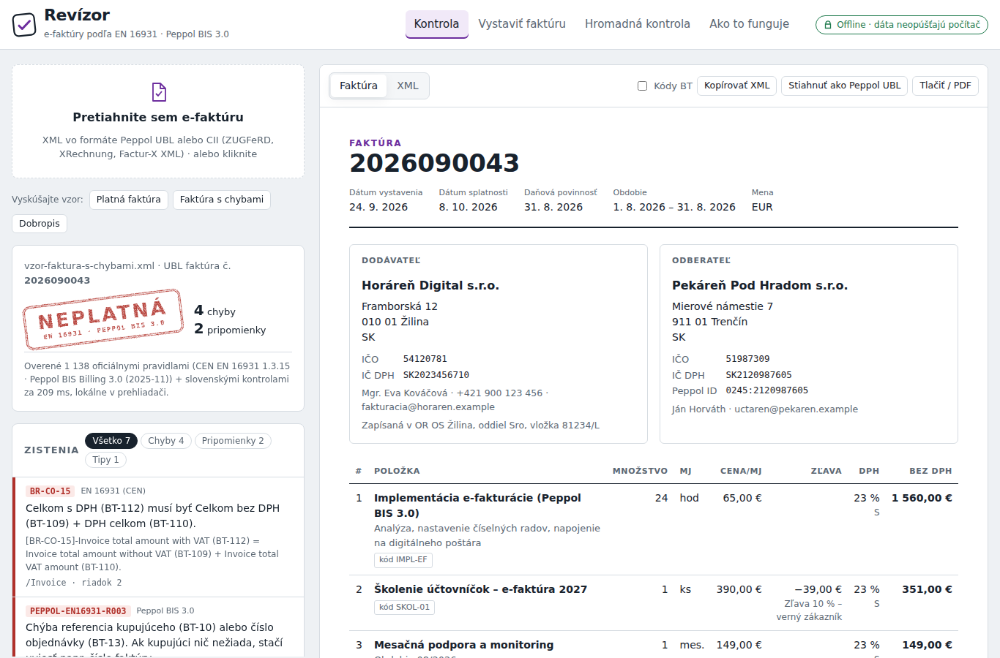
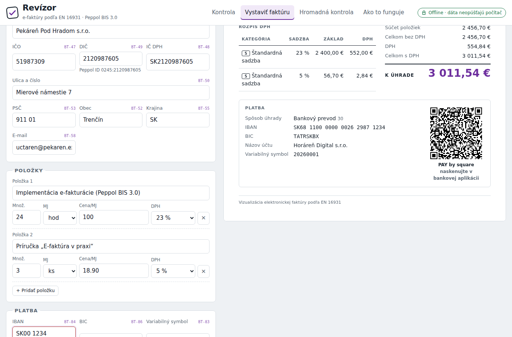
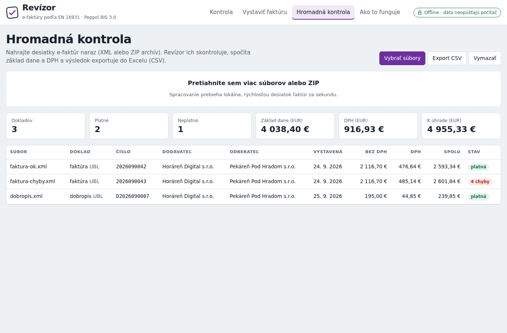

# Revízor – kontrola, zobrazenie a vystavenie e-faktúr (EN 16931 · Peppol BIS 3.0)

Od **1. 1. 2027** musia platitelia DPH na Slovensku vystavovať faktúry elektronicky (zákon č. 385/2025 Z. z.) vo formáte podľa **EN 16931 / Peppol BIS Billing 3.0**. Revízor je offline nástroj a SDK, ktorý:

- **skontroluje** e-faktúru **oficiálnymi pravidlami CEN a OpenPeppol** (1 138 pravidiel pre UBL, 865 pre CII) priamo v prehliadači, bez servera,
- **vysvetlí chyby po slovensky** s kódom pravidla, názvom poľa (BT-xx) a číslom riadku v XML,
- **zobrazí** XML ako čitateľnú faktúru s **QR kódom PAY by square**,
- **vystaví** platnú e-faktúru Peppol UBL cez formulár (výpočty podľa EN 16931, Peppol ID `0245:DIČ`),
- **hromadne** skontroluje stovky faktúr (aj zo ZIP) a exportuje súčty do Excelu,
- **prevedie** CII (ZUGFeRD / Factur-X XML / XRechnung) do Peppol UBL.

Faktúry sa nikam neodosielajú, všetko beží lokálne.



| Vystavenie faktúry | Hromadná kontrola |
|---|---|
|  |  |

## Rýchly štart

**Aplikácia bez inštalácie:** otvorte `dist/revizor.html` v prehliadači. Je to jediný súbor (~900 kB), funguje aj offline a dá sa nahrať na ľubovoľný webhosting.

**Príkazový riadok (Node.js ≥ 18):**

```bash
npm install
node cli/revizor.js validate samples/*.xml          # exit 1, ak je niektorá faktúra neplatná
node cli/revizor.js render samples/faktura-ok.xml   # → faktura-ok.html (tlač / PDF)
node cli/revizor.js convert zugferd.xml -o ubl.xml  # CII → Peppol UBL
node cli/revizor.js qr --iban SK6811000000002629871234 --amount 99.90 --vs 2026001 --name "Firma s.r.o." -o qr.svg
```

**SDK v Node.js:**

```js
import { createNodeValidator, readInvoice, renderInvoiceDocument } from './src/node.js';

const validator = createNodeValidator();            // CEN + Peppol + slovenské kontroly
const report = await validator.validate(xml);       // { ok, syntax, issues: [{ id, flag, messageSk, message, line, location }], ms }
const html = renderInvoiceDocument(readInvoice(xml));
```

**SDK v prehliadači (bez servera):**

```js
import { createValidator, skChecks } from './src/index.js';

const validator = createValidator((name) => fetch(`/rules/${name}.sch`).then((r) => r.text()), { extraChecks: [skChecks] });
```

## Čo je vo vnútri

| Časť | Súbor | Popis |
|---|---|---|
| XML parser | `src/xml/parser.js` | Namespace-aware, čísla riadkov, bez XXE a entity expansion |
| XPath 2.0 engine | `src/xpath/` | Typy `xs:decimal`/`xs:double`/`untypedAtomic`, osi, `for`/`some`/`every`, 70+ funkcií |
| Schematron runner | `src/schematron/` | Načíta **nezmenené** oficiálne `.sch` súbory vrátane `xsl:function` |
| Model faktúry | `src/model/read.js` | UBL Invoice/CreditNote + CII → jeden model podľa BT/BG |
| Výpočty | `src/model/calc.js` | Presná desiatková aritmetika (BigInt), rozpis DPH, zľavy/poplatky |
| Generátor UBL | `src/model/write-ubl.js` | Peppol BIS 3.0, poradie elementov podľa XSD UBL 2.1 |
| Vizualizácia | `src/render/invoice-html.js` | Slovenská podoba faktúry, bezpečná pre nedôveryhodný vstup |
| Platby | `src/pay/` | QR kód (ISO 18004), PAY by square (LZMA + base32hex), EPC QR |
| SK kontroly | `src/sk/` | IČ DPH, DIČ/Peppol ID 0245, IČO, IBAN, sadzby DPH 23/19/5 % |
| Preklady | `src/i18n/` | Slovenské vysvetlenia 1 534 z 1 694 pravidiel (zvyšok sú národné pravidlá iných krajín) |

Runtime nemá žiadne závislosti. `esbuild`, `playwright`, `jsqr` a `bysquare` slúžia iba na build a testy.

## Ako je overená správnosť

- **Parita s oficiálnym validátorom.** `scripts/parity.mjs` spustí tie isté `.sch` súbory cez referenčný Saxon-HE + SchXslt (Java) a cez engine Revízora na originálnych aj náhodne pokazených faktúrach. Porovnáva zoznam porušených pravidiel pravidlo po pravidle. Výsledok na aktuálnej verzii: **4 684 behov (UBL aj CII, 44 oficiálnych príkladov CEN/Peppol + vlastné vzorky, tisíce mutácií) bez jedinej nezhody.**
- **Zlaté testy bez Javy.** `test/fixtures/golden/` obsahuje 94 pokazených faktúr s výsledkom referenčného validátora; `npm test` ich overuje pri každej zmene.
- **Generované faktúry** prechádzajú XSD schémou UBL 2.1 aj oficiálnymi pravidlami (round-trip 29 oficiálnych príkladov bez nových chýb).
- **QR kódy** sa dekódujú nezávislou knižnicou jsQR pre verzie 1–40 × úrovne L/M/Q/H.
- **PAY by square** reťazce dekóduje referenčná implementácia `bysquare` bez odchýlky.
- **E2E test** (`npm run e2e`) prejde aplikáciou v Chromiu na desktope aj mobile.

```bash
npm test                                   # unit + zlatá parita
npm run build && npm run e2e               # jednosúborová aplikácia + test v prehliadači
bash scripts/reference/setup.sh .reference # referenčný validátor (Java)
node scripts/parity.mjs --ref .reference --corpus samples --mutants 300
```

## Aktualizácia pravidiel

OpenPeppol vydáva nové pravidlá zvyčajne v máji a novembri. Stačí nahradiť súbory v `rules/` novými `.sch` z [OpenPEPPOL/peppol-bis-invoice-3](https://github.com/OpenPEPPOL/peppol-bis-invoice-3/tree/master/rules/sch), spustiť `npm test`, parity test a `npm run build`. Kód sa meniť nemusí.

## White-label

```bash
echo '{"brand":"Moja Firma e-faktúra","tagline":"Kontrola e-faktúr","contact":"podpora@mojafirma.sk"}' > brand.json
node scripts/build.mjs --config brand.json
```

Výstupy: `dist/revizor.html` (plná verzia), `dist/revizor-demo.html` (bez sťahovania, pre ukážky), `dist/embed/index.html` (fragment na vloženie do iného webu).

## Obmedzenia

- Revízor **nie je digitálny poštár** (certifikovaný poskytovateľ doručovacej služby). Faktúry kontroluje, zobrazuje a vytvára, ale neodosiela.
- Oficiálne pravidlá predpokladajú XML, ktoré prešlo schémou UBL/CII. Revízor zatiaľ **nevykonáva kontrolu XSD** v prehliadači (napr. zlé poradie elementov). Generované faktúry sú XSD-validné.
- Prevod CII → UBL pokrýva model EN 16931. Rozšírenia nad normu (napr. špecifiká XRechnung) sa neprenášajú.
- PAY by square používa hlavičku verzie 1.2.0 (rovnako ako referenčná knižnica). Kompatibilitu so staršími bankovými aplikáciami treba overiť na reálnych telefónoch.
- Slovenské vysvetlenia chýbajú pri národných pravidlách iných krajín (DE, DK, SE, NO, IT, GR, IS, NL). Tam sa zobrazí oficiálny anglický text.

## Licencie

Kód Revízora: pozri [LICENSE.md](LICENSE.md). Súbory v `rules/` sú oficiálne pravidlá © CEN a OpenPeppol pod licenciou EUPL 1.2, distribuované bez úprav. Podrobnosti v [NOTICE.md](NOTICE.md).

Obchodný plán a podklady na predaj: [SALES.md](SALES.md).
